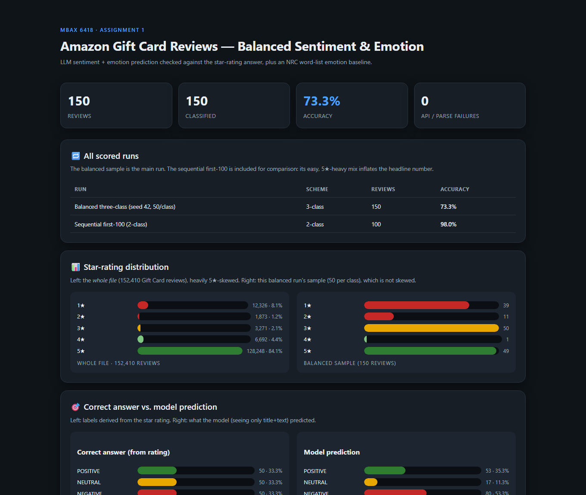
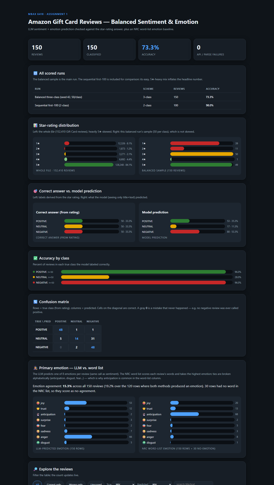

# MBAX 6418 · Assignment 1 — Sentiment & Emotion Classification of Amazon Reviews

A working review-sentiment classifier for **Amazon Gift Card** reviews. It
classifies each review as **POSITIVE / NEUTRAL / NEGATIVE**, detects the
**primary emotion** two independent ways (an LLM prediction and an NRC word-list
derivation), checks the predictions against the **star-rating answer**, and
presents everything in a single self-contained, offline HTML dashboard.

**Data source:** [Amazon Reviews '23](https://amazon-reviews-2023.github.io), a
large-scale product-review dataset collected by the **McAuley Lab at UC San
Diego**. This project uses the **Gift Cards** review category
(`review_categories/Gift_Cards.jsonl.gz`): a gzipped JSON-Lines file of
**152,410 individual reviews**. Each line is one review with `rating`, `title`,
`text`, and metadata (`verified_purchase`, `helpful_vote`, `timestamp`,
`images`, `asin`, `parent_asin`, `user_id`).

The dashboard below shows every number quoted in this report; the same figures
also live in `results/summary_*.json` and `results/predictions_*.jsonl`.



---

## Highlights

| Metric | Value |
|---|---|
| Gift Card reviews in the file | 152,410 |
| Star distribution (whole file) | 5★ 84.1% · 4★ 4.4% · 3★ 2.1% · 2★ 1.2% · 1★ 8.1%, heavily 5★-skewed |
| Sequential 100-row, 2-class accuracy | **98.0%** (98/100) |
| Balanced 3-class accuracy (seed 42, 50/class) | **73.3%** (110/150) |
| LLM emotion vs. NRC word-list emotion (over all 150) | **15.3%** |

---

## Model, prompt, and endpoint

- **Model:** `cyankiwi/Qwen3.6-35B-A3B-AWQ-4bit` served on the
  OpenAI-compatible endpoint supplied for the course (`http://dobolyi.com:9001/v1`).
- **Input to the model:** only `title` + `text`. The star rating is used
  **solely** to label the answer afterwards; it never reaches the model.
- **Structured prompt:** defined in [`classifier.py`](classifier.py). It asks for
  a strict single JSON object per review, so results are read back
  programmatically, with tolerant parsing for code fences and trailing prose.
- Prompts exist for the 2-class task (POSITIVE/NEGATIVE, Step 1-2) and the
  3-class task (POSITIVE/NEUTRAL/NEGATIVE, Step 6), and optionally add
  primary-emotion detection (Step 5) in the same call.

### Spot check (Step 1)

Before scoring, the prompt was run on hand-written obvious and edge cases and
got them all right, including a positive-title/negative-body review (*"Great
looking card — but it would not load, very frustrating"* → NEGATIVE) and a terse
one (*"Ugh … so disappointed"* → NEGATIVE).

---

## Why the lopsided run looked too good (Q1)

The file is dominated by ★★★★★ reviews: mapped to sentiment, roughly 88% of the
whole file is positive. A classifier that usually guesses "POSITIVE" will be
right most of the time without learning to separate the classes.

On the **sequential first-100** batch (98.0% accuracy) that is exactly what
happened. The batch happened to contain **93 positive and 7 negative** reviews
by the 2-class rule (remember, that rule puts ★3 with the negatives). The model
aced the easy positive majority (92/93) and handled the tiny negative minority
(6/7), which flatters the headline number. That result only tells you the model
is decent; it says nothing about rare classes, because the batch had almost
none.

The balanced re-score tells the real story. **Sampling equal numbers of each
class dropped the headline accuracy from 98.0% to 73.3%**, and it showed where
the mistakes concentrate. The model is near-perfect on clearly positive and
clearly negative reviews (96.0% each) and nearly useless on neutral ★★★ ones
(28.0%). **Collapsing neutral into negative on the balanced set (treating a
predicted NEUTRAL as agreeing with a negative answer) gives 143/150 = 95.3%**,
so the neutral class alone accounts for most of the gap between the two runs.

The two misses in the sequential run are worth naming. The model called *"**No
note attached to sent gift card**"* (a ★5 rating, but written as a complaint
because the present arrived without the requested note) NEGATIVE instead of
POSITIVE. It also called the ★3 review *"**Easy to use. Very easy to use**"*
POSITIVE, which the 2-class rule files as a miss only because ★3 counts as
negative; on the 3-class scheme that review is neutral, and the model's reading
is arguably right. One genuine error, one labeling artifact.

---

## Results

### Step 2 — Sequential 100-row, 2-class

- **98.0%** accuracy (98/100), 0 API/parse failures.
- Per class: POSITIVE **92/93 (98.9%)**, NEGATIVE **6/7 (85.7%)**.
- The 2 disagreements are listed above and saved in
  `results/predictions_seq100.jsonl`. A reminder that the model never saw any
  rating while producing these predictions.

### Step 6 — Balanced three-class (seed 42, 50 per class)

- **73.3%** accuracy (110/150), 0 API/parse failures. Every number below is
  read directly from `results/summary_balanced3.json`.
- Per-class accuracy:
  - POSITIVE: **48/50 = 96.0%**
  - NEUTRAL: **14/50 = 28.0%**
  - NEGATIVE: **48/50 = 96.0%**
- **The ★★★ neutral class collapses into NEGATIVE.** Of the 50 true ★3 reviews,
  only 14 were called NEUTRAL, while **31 were dragged into NEGATIVE (62%)** and
  5 into POSITIVE. The confusion grid in the dashboard shows the full picture:
  the only zero cell is NEGATIVE→POSITIVE, meaning no negative review was ever
  called positive. So the failure is directional: lukewarm reviews get read as
  complaints, but complaints never get read as praise.

### Step 5 — Primary emotion: LLM vs. NRC word list (Q3)

- The **LLM** predicts one of 8 emotions (anger, anticipation, disgust, fear,
  joy, sadness, surprise, trust) alongside sentiment in the same call; it
  produced an emotion on **150/150** rows.
- The **NRC word list** is matched against each review's words; emotion counts
  are summed and the highest is the answer. It produced an emotion on **120/150**
  rows (30 reviews had no NRC-listed emotion word) with no model calls.
- Agreement: **15.3% across all 150 rows** (23 matches), or **19.2%** over the
  **120 rows** where both methods produced an emotion. The 30 no-emotion rows
  count as no agreement, which is why the all-rows number is lower.
- The two methods disagree systematically, and the reasons are now clear:
  1. **The word list breaks ties alphabetically, and ties are common.** 62 of
     the 120 word-list labels were ties, and **49 of those went to
     anticipation** (the alphabetically-first winner via `max()` order). The
     word "gift" alone is tagged anticipation, joy, and surprise, so short
     gift-card reviews tie often and anticipation dominates the word-list
     column (68 of 120 labels) instead of the review's actual mood.
  2. **The LLM uses anger as its default negative emotion.** It picked anger
     for **41 of the 50 negative** reviews and **24 of the 50 neutral** ones,
     while the word list spreads those across sadness, anticipation, and fear.
- A concrete divergence: *"Gift message not included. Very disappointing"* is
  **anticipation** by the word list (the "gift" tie wins alphabetically) but
  **sadness** by the LLM. The lexicon tags "disappointing" as sadness, yet the
  tie-break overrides it, so the two methods come to opposite answers on the
  same sentence.

---

## How it is built (files)

| File | Purpose |
|---|---|
| `classifier.py` | The prompt + OpenAI-compatible LLM plumbing (call, disk cache, parsing). |
| `scoring.py` | Loads reviews, labels the answer from the rating, runs the classifier, saves results + a JSON summary. Supports sequential and balanced sampling, 2-class and 3-class, with optional emotion. |
| `emotions_nrc.py` | Loads the NRC Word-Emotion Association Lexicon and derives a per-review primary emotion from word counts alone (no model calls). |
| `build_dashboard.py` | Generates the self-contained HTML dashboard from a predictions file. |
| `run_pipeline.py` | One-call convenience: add NRC columns, compute whole-file stats, build the dashboard, print a recap. |
| `download_data.py` | Downloads the reviews file + NRC lexicon, keeping large and non-redistributable data out of the repo. |
| `results/` | Saved raw predictions (`predictions_*.jsonl`), summaries (`summary_*.json`), and the dashboard copy. |
| `shots/` | Screenshots of the dashboard used in this report. |

**Reproduce:**
```bash
pip install -r requirements.txt
python download_data.py     # fetches data/ (reviews + NRC lexicon); gitignored

# Step 2 run (sequential first 100, 2-class)
python scoring.py --rows 100 --label 2class --tag seq100

# Step 6 run (balanced 150, 3-class, with LLM emotion, fixed seed)
python scoring.py --balanced --per-class 50 --label 3class --with-emotion --seed 42 --tag balanced3

# NRC emotions + dashboard
python run_pipeline.py results/predictions_balanced3.jsonl -o dashboard.html
```
This order matters: the `--tag` flags are what make `run_pipeline.py`'s input
file (`predictions_balanced3.jsonl`) exist.

> The NRC Emotion Lexicon is © National Research Council Canada and is licensed
> for non-commercial research/educational use only (no redistribution). This
> repository therefore does not commit it; `download_data.py` fetches it on
> demand and `.gitignore` keeps it out of version control.

---

## Built with an agent (process notes and bugs found, Q4)

Every step was driven with the agent workflow: choosing the OpenAI-compatible
SDK, the structured-JSON prompt, the fixed-seed balanced sample, and a
single-file offline dashboard. Bugs found along the way, and their fixes:

- **Unscored filter showed wrong rows.** The review-table filter for "Unscored"
  tested `!r.correct`, which matched every *wrong* row (40 of them) as well as
  truly unscored ones. Fixed to test `r.correct === null`; the filter now shows
  0 (there were no unscored rows in the final run). Verified by running the
  dashboard's own script against the real data in a headless DOM.
- **Review table initially showed "Showing 0".** The JS keyed rows by an index
  that was missing from the serialized data. Fixed by embedding the row index,
  verified after rebuild.
- **Confusion matrix only listed non-zero cells.** The zero in
  NEGATIVE→POSITIVE is itself a finding, so the dashboard now draws a full 3×3
  grid with gray zeros.
- **Star chart caption claimed the sample was 5★-skewed.** The chart showed the
  balanced sample, which is not skewed. The dashboard now shows both the
  whole-file distribution (152,410 reviews) and the balanced sample, each
  labeled.
- **A `max(dist.values(), 1)` normalization bug** raised a `TypeError` when the
  chart data was built. Fixed by precomputing the maximum. Layout was
  re-verified in the browser so small bars keep their width.
- **The word list left 30 reviews with no emotion**, silently. The dashboard
  now says so explicitly and counts the 30 as no-agreement rows.

The headline numbers on the page were re-checked against the saved JSON before
publishing, and the figures quoted in this report match what the dashboard and
`results/` show.

## Dashboard

Open **`dashboard.html`** (or `results/dashboard_balanced3.html`) in any
browser: data, styling, and interactivity are all in one file, no server or
network needed. It shows headline KPIs, the whole-file vs. sample star
distribution, a runs-comparison table (98.0% sequential vs. 73.3% balanced),
correct answer vs. predicted, per-class accuracy, a full confusion grid, the
LLM vs. NRC emotion comparison, and a **filterable review table** (all /
correct-only / wrong-only / unscored, by true class, by predicted class,
free-text search) with a live count.



---

## Author / review

This report and project were generated with the assignment's agent workflow.
Every number quoted here is read directly from the saved output under
`results/` and was re-checked against the rendered dashboard; final review and
verification was performed by the student submitting it.
